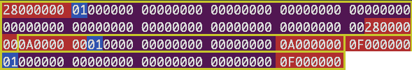

[](https://github.com/rfmineguy/malloc-impl/actions/workflows/macos-arm.yml)
[](https://github.com/rfmineguy/malloc-impl/actions/workflows/linux.yml)
[](https://github.com/rfmineguy/malloc-impl/actions/workflows/windows.yml)

# My Malloc
This repository is meant to host and be a display of my journey through implementing malloc/calloc/free for my main operating system project.

# What's The Problem
This is meant to solve some issues I had in my kernel's early allocator which relied on two arena allocators (one for the allocation linked list, and one for the heap).<br>
<br>
This design is unfortunate because the arenas act as a huge block of preallocated memory, that has no ability to free memory. The best you can do is reuse "freed" memory via a freelist (which itself needs to live somewhere).<br>
<br>

# What's The Solution?
I've seen things around that encode the allocation size, and state directly in the memory being allocated from. This eliminates the problem of needing a linked list for managing the free and used blocks of memory.
This is typically called heap metadata

## Explanation
The memory is layed out in a special encoding.. when you call malloc, it searches the heap for *free* blocks.
- A block is free when it a certain bit in a flags byte is unset.

# Implementation
## Malloc Implementation
```
1. Search heap for first free region that is big enough
2. If the search went passed the end of the heap, give up
3. Mark the beginning and end of this free region with its size
4. Shrink the size of the free region this memory came from
```

## Malloc Time Complexity
The time complexity of `mymalloc` is O(k) worst case where<br>
- k is the number of allocations made previouly
Due to using metadata to jump large segments of the heap, we can measure in terms of allocations rather than bytes hence the k.

## Calloc Implementation
```
1. Use malloc to get the memory region
2. Memset the region to 0
```

## Calloc Time Complexity
The time complexity of `mycalloc` is derived from the time complexity of `mymalloc`.<br>
`mycalloc` zeroes out the allocation made and returns the pointer to it therefore we can say that it is O(k + m), where 
- k is the number of allocations made previously
- m is the size of the allocation just made (memset to zero)

## Free Implementation
```
1. Mark the region as free
2. Check the previous region to see if its free
3. If it is, then merge the two regions
4. Check the next region to see if its free
5. If it is, then merge the two regions
```

## Free Time Complexity
The time complexity of `free` is O(1)<br>
Due to having metadata telling us the size of the allocated regions we can simply use pointer arithmetic to navigate the heap relative to the pointer being freed.<br>
